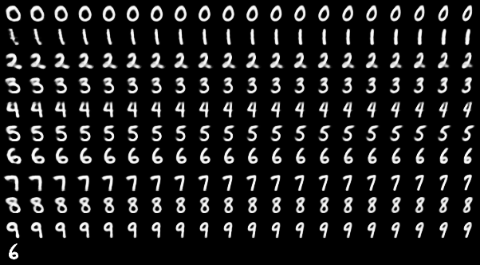

# Variation Network
Implementation of the "Variation Network: Learning High-level Attributes for Controlled Input 
Manipulation" [paper](https://arxiv.org/abs/1901.03634).

Uses Python 3.6, PyTorch 1.0, Visdom and torchkit from [https://github.com/CW-Huang/torchkit](https://github.com/CW-Huang/torchkit).

## Usage
The `environment.yml` file contains a Anaconda virtual environment you can create and load with
```bash
conda env create --name varnet -f environment.yml
source activate varnet
```

Train a new model from scratch and monitor the results by
* lauching Visdom in a separate terminal with `visdom`
* running `python experiments.py --train --plot`
* opening a web browser at `http://localhost:8097/` (default visdom port).

This displays training curves, reconstructions, random samples and variations. 
The attribute function of this model is composed of a *free* attribute and of the *fixed* "digit 
class" attribute. 
 


### Cite
```
@Article{Hadjeres2018,
author="Hadjeres, Ga{\"e}tan
and Nielsen, Frank",
title="Anticipation-RNN: enforcing unary constraints in sequence generation, with application to interactive music generation",
journal="Neural Computing and Applications",
year="2018",
month="Nov",
day="20",
abstract="Recurrent neural networks (RNNs) are now widely used on sequence generation tasks due to their ability to learn long-range dependencies and to generate sequences of arbitrary length. However, their left-to-right generation procedure only allows a limited control from a potential user which makes them unsuitable for interactive and creative usages such as interactive music generation. This article introduces a novel architecture called anticipation-RNN which possesses the assets of the RNN-based generative models while allowing to enforce user-defined unary constraints. We demonstrate its efficiency on the task of generating melodies satisfying unary constraints in the style of the soprano parts of the J.S. Bach chorale harmonizations. Sampling using the anticipation-RNN is of the same order of complexity than sampling from the traditional RNN model. This fast and interactive generation of musical sequences opens ways to devise real-time systems that could be used for creative purposes.",
issn="1433-3058",
doi="10.1007/s00521-018-3868-4",
url="https://doi.org/10.1007/s00521-018-3868-4"
}
```

